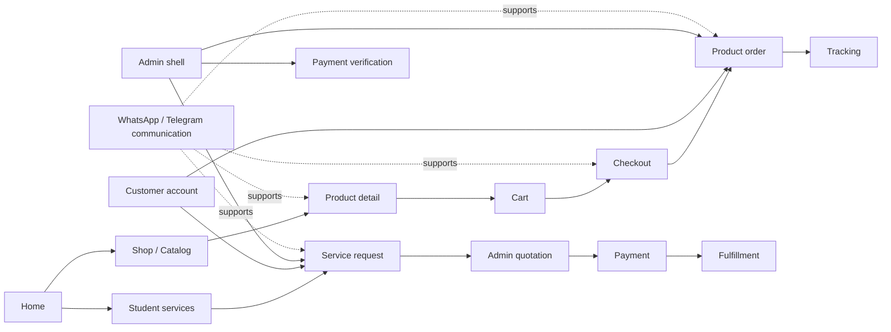
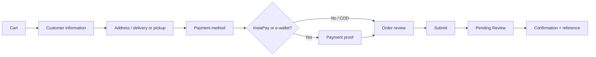
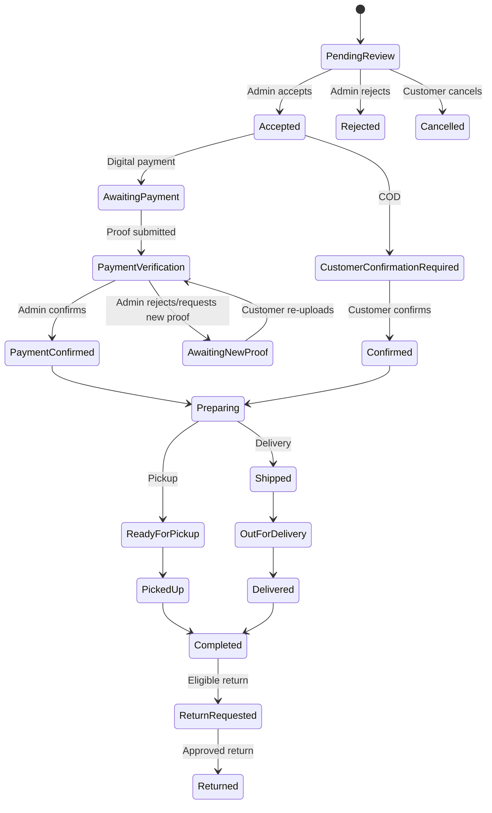
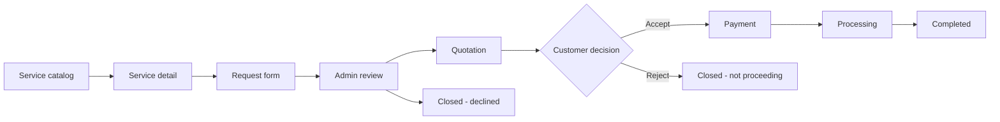

# UX/UI SPECIFICATION — AL-AZHARI LIBRARY

**مكتبة الأزهري**

Implementation-ready UX/UI specification for the Arabic-first, RTL-first storefront, customer account, student-service request platform, and Admin operating interface.

> **Version:** 1.0  
> **Status:** Draft for stakeholder review  
> **Date:** 22 September 2026  
> **Implementation target:** Angular + Tailwind CSS; Node.js/Express API; MongoDB; Cloudinary for payment-proof media; Socket.IO for real-time delivery  
> **Primary locale:** Arabic / RTL; English / LTR supported  
> **Functional authority:** Product Requirements Document v1.0  
> **Business/context authority:** Master Product Brief v2.0  
> **Architecture authority:** Information Architecture & Sitemap baseline  
> **Visual authority:** Design System baseline

---

## 1. Document Control

### 1.1 Purpose

This document translates the approved product, business, information-architecture, and design-system material into screen behavior, content hierarchy, state behavior, UI data requirements, and implementation handoff rules.

It is intended to let:

- a UX/UI designer design every public, customer, service, and Admin screen;
- a frontend developer implement the routes, components, responsive behavior, and states;
- a backend developer understand the records and transitions exposed by the interface;
- QA derive functional, visual, responsive, RTL/LTR, permission, and edge-case tests;
- the business owner review the customer and operational experience without reading implementation code.

This is a UX/UI specification. It does not replace the PRD, Master Product Brief, IA/Sitemap, or Design System, and it does not settle an Open Decision.

### 1.2 Source hierarchy

1. Explicit decisions in the PRD brief and PRD v1.0.
2. Master Product Brief v2.0.
3. Information Architecture & Sitemap baseline.
4. Existing approved brand identity and logo.
5. Design System baseline.
6. Recommendations in this document, clearly labelled as such.

When sources differ, the conflict is shown rather than silently resolved. The payment-method discrepancy is retained as **OD-20**.

### 1.3 Status vocabulary

| Label | Meaning | Treatment in this specification |
|---|---|---|
| **CONFIRMED** | Explicitly stated or decided in the governing sources. | Must be preserved. |
| **UI DATA RECOMMENDATION** | A data shape needed to render an already-confirmed interface, without creating a new business rule. | Review during implementation; do not turn into policy. |
| **PRODUCT RECOMMENDATION** | A UX or product interpretation flagged as requiring approval. | Do not hard-code as confirmed until approved. |
| **OPEN DECISION** | Unresolved business, policy, permission, or operational behavior. | Keep configurable or visibly unresolved. |
| **DESIGN SYSTEM EXTENSION** | A missing reusable UI pattern proposed to complete the documented experience. | Add only with the smallest consistent extension. |

### 1.4 Related documents

- `AL-AZHARI-LIBRARY-PRD_1790086531154.pdf`
- `AL-AZHARI-LIBRARY-MASTER-PRODUCT-BRIEF_1790086531153.pdf`
- `AL-AZHARI-LIBRARY-Information-Architecture-and-Sitemap_1790086531153.pdf`
- `DESIGN-SYSTEM_1790086531154.md`
- `Pasted-You-are-a-Senior-Product-Designer-UX-Architect-Design-S_1790086532784.txt`

### 1.5 Product boundary

The product is the digital extension of a real library and store in Qena. It is:

- a books-first online storefront;
- a searchable catalog for books, school/study products, and secondary products;
- a separate request-and-quotation channel for student services;
- a customer relationship surface for order and service status;
- an Admin operating system for catalog, orders, payments, inventory, shipping, returns, content, and reports.

It is not an LMS, course platform, social network, marketplace, review platform, automated payment gateway, or file-upload platform for service attachments.

---

## 2. UX Principles

1. **Books first.** Books lead navigation, default merchandising, home discovery, and catalog emphasis. Supplies, services, gifts, and games support the core rather than competing with it.
2. **Clarity before decoration.** Every purchaseable product must make its identity, price, availability, and next action easy to understand.
3. **Trust before pressure.** Use real availability, price, payment, shipping, and order states. Do not use unsupported urgency or “best/number one” claims.
4. **Self-service where the answer is stable.** Availability, price, product detail, cart, checkout, and order status should not require a conversation for ordinary cases.
5. **Human support where judgment is needed.** Keep WhatsApp visible for clarification and edge cases, without making it the order or service record.
6. **Services are not products.** A variable-price service follows request → review → quotation → customer decision → payment → fulfillment. It does not enter the product cart.
7. **Arabic and RTL are primary.** Design composition, type scale, line length, focus order, tables, and directional controls for Arabic first.
8. **Mobile is a primary experience.** Existing discovery and support behavior is concentrated in social and messaging channels; every core flow must work on a phone.
9. **Every state is designed.** Loading, empty, no results, unavailable, rejected, pending, error, success, and permission states are first-class screens or component variants.
10. **Seasonal presentation is a layer.** Seasonal products and services may be promoted on home and content surfaces, but the permanent catalog and navigation remain year-round.
11. **The website is the source of truth.** WhatsApp communicates; authoritative orders, service requests, payments, and state changes live in the platform.
12. **Do not guess.** Missing policy, service fields, rates, timelines, permissions, and numeric thresholds remain Open Decisions.

---

## 3. Global Experience Architecture

### 3.1 Domain boundaries



Product orders and service requests are separate records with separate state machines. Do not create a second checkout for services or a second catalog for pre-orders.

### 3.2 Global header

**Desktop storefront:** approved logo, Shop, Services, Search, Account, Cart, and WhatsApp. Shop remains the principal discovery route.

**Mobile storefront:** compact menu, approved logo/mark, search, cart, and accessible account entry. Keep persistent WhatsApp access without allowing it to obscure the primary action.

**Account shell:** account navigation with current operational state (orders, services, notifications) above secondary profile settings.

**Admin shell:** separate authenticated application, not a public navigation branch. Persistent desktop sidebar; compact top bar and drawer on mobile.

### 3.3 Search

Search supports the documented fields: product name, author, grade, stage, subject, publisher, ISBN, and category. Missing metadata on one product must not make it undiscoverable through other populated fields.

Search UI must include:

- a labelled input and explicit submit/search action;
- current query;
- active filters and clear actions;
- result state, count when available, and no-results state;
- recoverable API error;
- mobile filter trigger and filter drawer/sheet.

No advanced search, ranking logic, autocomplete, or additional filter may be presented as a requirement unless approved.

### 3.4 Account, cart, and notifications

- Guest checkout is always available; do not force registration before purchase.
- Registered customers can access profile, orders, addresses, payment history, service requests, pre-orders, and notifications.
- Cart is for fixed-price products and variants only.
- In-app notifications follow authoritative state changes. Email is used for verification, password reset, and relevant transactional communication.
- Socket.IO is a delivery convenience. If it fails, persisted state must appear on refresh.

### 3.5 WhatsApp and Telegram boundary

WhatsApp is a contextual communication action:

- global header/footer and contact page;
- product detail: ask about product or availability;
- cart/checkout: get help;
- order detail/tracking: contact the library about this order;
- services: clarify a request and exchange files when needed;
- Admin order/customer/service detail: contact the customer.

The CTA must not imply that a chat creates, changes, confirms, or cancels a record. Service-file exchange is via WhatsApp/Telegram; no service attachment upload is shown in the platform.

### 3.6 Footer

Use confirmed business and location information only. Final phone numbers are **OD-01**. Do not display invented business hours, delivery promises, policy language, or contact details.

### 3.7 Language and direction

```html
<html lang="ar" dir="rtl">
```

Switch to `lang="en" dir="ltr"` for English. Use logical CSS properties and directional isolation for phone numbers, email addresses, ISBNs, URLs, order references, and mixed technical strings.

### 3.8 Global state behavior

All data-loading surfaces need a skeleton/loading variant, recoverable error variant, and not-found/empty variant where applicable. A state-changing action shows a pending/disabled treatment, then a success notification or inline result; failure preserves user input and provides retry.

---

## 4. Page Inventory

### 4.1 Public and transaction pages

| ID | Route | User/auth | Purpose and primary CTA | Required data | Main states and exits |
|---|---|---|---|---|---|
| PUB-001 | `/` | Guest/customer | Books-first entry; **Shop** | Brand copy, featured books/categories, seasonal modules, services preview, confirmed contact/location | Loading, content error, empty module; Shop, Services, Search, WhatsApp |
| PUB-002 | `/shop` | Guest/customer | Permanent catalog entry; **Browse books** | Active categories, featured products, availability | Loading, empty catalog, error; category/search/product |
| CAT-001 | `/shop/all` | Guest/customer | Browse active products; **Open product** | Product-card data, filters, supported sort | Loading, no products, no results, error; product/cart |
| CAT-002 | `/categories/:slug` | Guest/customer | Browse a stable category; **Refine/open product** | Category, result products, filters | Loading, empty, no results, error; search/product |
| CAT-003/004 | `/search?q=…` / query filters | Guest/customer | Find by documented fields; **Search/open result** | Query, filters, products, active filter chips | Initial, results, no results, API error; clear/refine/product |
| CAT-005 | `/products/:slug` | Guest/customer | Evaluate and purchase/pre-order; **Add to Cart** or **Pre-order** | Product, images, description if authored, metadata, variants, price, availability | Loading, in-stock, out-of-stock eligible/unavailable, not found, error; cart/pre-order/WhatsApp |
| TRX-001 | `/cart` | Guest/customer | Review products; **Proceed to checkout** | Line items, variant, quantity, price, availability, discounts, total | Empty, stale price/availability recommendation, error; shop/checkout/WhatsApp |
| TRX-002–006 | `/checkout/customer`, `/checkout/fulfillment`, `/checkout/payment`, `/checkout/payment-proof`, `/checkout/review` | Guest/customer | Submit fixed-price product order | Recipient, address, fulfillment, payment, proof where applicable, coupon, totals | Validation, missing proof, serviceability, API error, submitted; previous/next step |
| TRX-007 | `/orders/:id/confirmation` | Guest/customer, conditional access | Confirm receipt and reference; **View order** | Order reference, initial Pending Review, summary, next step | Success, retrieval error; order/tracking/WhatsApp |
| ORD-001/002 | `/orders/:id`, `/orders/:id/tracking` | Guest/customer, conditional/account | View authoritative order and lifecycle | Items, costs, payment, fulfillment, timeline, notifications | Every documented order state, not found, unauthorized; return/WhatsApp |
| SRV-001/002 | `/services`, `/services/catalog` | Guest/customer | Enter separate service model; **Choose service** | Confirmed service categories, request explanation | Empty/error; service detail/request |
| SRV-003/004 | `/services/:slug`, `/services/:slug/request` | Guest/customer | Explain and submit request; **Submit request** | Service, approved fields only, communication channel | Loading, validation, submitted, error; request detail/WhatsApp |
| PRE-001 | `/products/:slug/pre-order` | Guest/customer | Request eligible unavailable product; **Submit pre-order** | Product/variant, quantity, captured price, expected availability if entered | Eligibility error, validation, submitted; product/account |
| SUP-001 | `/contact` | Guest/customer | Access confirmed contact/support | Confirmed location/contact; phone only when OD-01 is resolved | Missing contact data, error; WhatsApp/home |

### 4.2 Authentication and account pages

| ID | Route | User/auth | Purpose and primary action | Required data | States and exits |
|---|---|---|---|---|---|
| ACC-001 | `/login` | Guest | Sign in with email or phone + password | Identifier, password | Validation, invalid credentials, loading, success; account/return route |
| ACC-002 | `/register` | Guest | Create account | Name, phone, unique valid email, password | Validation, duplicate email/phone, loading, success; verification |
| ACC-003 | `/verify-email` | Conditional customer | Verify email | Verification status/token | Invalid/expired token, success; login/account |
| ACC-004/005 | `/forgot-password`, `/reset-password` | Guest/conditional | Recover account by email | Email, reset token, new password | Validation, invalid/expired token, success; login |
| ACC-006 | `/account` | Registered customer | Current activity overview | Own current orders, service requests, notifications | Loading, empty, error; account areas |
| ACC-007 | `/account/profile` | Registered customer | View/edit profile | Own profile | Validation, loading, save success/error |
| ACC-008 | `/account/orders` | Registered customer | Order history | Own orders/statuses | Loading, no orders, error; order detail |
| ACC-009 | `/account/addresses` | Registered customer | Manage saved addresses | Own addresses; no map pin | Empty, validation, save/delete confirmation/error |
| ACC-010 | `/account/payments` | Registered customer | Payment history | Own payment/proof/refund summaries | Empty, loading, error; order/return |
| ACC-011 | `/account/services` | Registered customer | Service request history | Own service requests and states | Empty, loading, error; request/quotation |
| ACC-012 | `/account/pre-orders` | Registered customer | Pre-order history | Own pre-orders | Empty, loading, error; pre-order/order |
| ACC-013 | `/account/notifications` | Registered customer | Lifecycle notifications | Own notifications/read state | Empty, loading, error; related record |
| RET-001/002 | `/orders/:id/return`, `/account/returns/:id` | Registered customer | Request and track eligible return/refund | Completed order, eligible items, reason, evidence where appropriate, refund record | Not eligible, validation, submitted, review/approved/rejected/refund states |

### 4.3 Admin pages

All Admin pages require an authenticated Admin or Owner session, subject to configured permissions. Each list has loading, empty, no-results, API error, and forbidden variants; each mutation has pending, success, failure, and audit-result behavior.

| ID | Route | Purpose / primary actions | Required data and states |
|---|---|---|---|
| ADM-001 | `/admin` | Operational dashboard; open priority queue | Counts/queues only from available records; loading, empty, error |
| ADM-002/003 | `/admin/orders`, `/admin/orders/:id` | Review, accept/reject, payment/COD gate, shipping, fulfillment | Order, stock, customer, proof, audit; state-specific action availability |
| ADM-004/005 | `/admin/products`, `/admin/products/:id/edit` | Create/edit/publish products and variants | Identity, categories, images, description, price, availability, stock; validation and save states |
| ADM-006 | `/admin/categories` | Maintain stable taxonomy | Books-first ordering; future categories inactive in MVP |
| ADM-007 | `/admin/customers` | View operational customer record | Profile, orders, services, payment history, WhatsApp; permission/error states |
| ADM-008 | `/admin/payments` | Verify proofs | Screenshot(s), order context, Confirm/Reject/Request New Proof, audit trail |
| ADM-009/010 | `/admin/services`, `/admin/services/requests/:id` | Manage service catalog, review requests, clarify, quote, progress | Service fields remain configurable until approved; no service-file upload |
| ADM-011 | `/admin/pre-orders` | Review requests, accept/reject, mark availability | Pre-order fields, price, expected availability if entered, fulfillment state |
| ADM-012 | `/admin/inventory` | View/adjust stock | Total, reserved, available; thresholds remain open |
| ADM-013 | `/admin/shipping` | Select provider, adjust estimate, progress delivery | Provider, estimate, final cost, status; rate source/binding remain open |
| ADM-014/015 | `/admin/returns`, `/admin/refunds/:id` | Review return, approve/reject, record manual refund | Evidence, reason, amount, method, timestamp; policy/SLA remain open |
| ADM-016 | `/admin/notifications` | View operational events | Event, recipient, timestamp, read state; real-time fallback |
| ADM-017 | `/admin/content` | Edit product descriptions and seasonal/home merchandising | Content modules; must not mutate permanent taxonomy |
| ADM-018 | `/admin/coupons` | Manage discount definitions and usage | Percentage/fixed, scope, active state; governance rules configurable/open |
| ADM-019 | `/admin/reports` | View approved business reporting dimensions | Orders, revenue, geography, payment methods, services, demand, pre-orders, coupons; no invented targets |
| ADM-020 | `/admin/settings` | Settings/RBAC boundary | Owner/Admin baseline only; do not imply undefined Owner-only actions |
| ERR-001/002 | `/403`, `/404` | Safe permission and not-found recovery | No data leakage; login/home/search recovery |

---

## 5. Storefront UX

### 5.1 Home page

Order modules by customer decision value:

1. Header and primary discovery.
2. Hero with a clear online-library proposition and Shop CTA; no unverified superlatives.
3. Featured/highlighted books and books-first category access.
4. Stable categories: Books, School/Study Products, Other Products.
5. Seasonal modules for summaries, applications/transfers, or school supplies; temporary presentation only.
6. Services preview explaining request → review → quotation and linking to Services.
7. Trust/practical information: visible availability and prices, pickup, cash/support options where confirmed.
8. Persistent/contextual WhatsApp CTA.
9. Footer with confirmed information.

The home page must serve general-education students, university students, and parents as well as Azhar-track customers. Azhar depth is the differentiator, not an audience restriction.

### 5.2 Catalog and category pages

- Keep Books first in navigation and visual emphasis.
- Show product name, image, price, availability, and applicable variant context in each card.
- Use documented filters only: education type, stage, grade, subject, publisher, price range, availability.
- Preserve active filters visibly; allow individual removal and clear-all.
- On mobile, filters open in a bottom sheet or drawer with Apply and Cancel/close behavior; the result context remains visible.
- Use pagination or load more only as an implementation choice consistent with the API; do not invent a ranking or sort order. Mark the exact sort order **OPEN DECISION** if required.
- Empty category: explain that the category has no currently published products and provide parent categories/search.
- No results: repeat query/filters, allow clearing/refining, and provide Shop/WhatsApp fallback.

### 5.3 Product detail

Information hierarchy:

1. Breadcrumbs and category context.
2. Product image(s) as catalog evidence.
3. Name and concise description when authored.
4. Applicable metadata: author, grade, stage, subject, publisher, ISBN, education type.
5. Variant selection where commercially meaningful.
6. Price and availability.
7. Primary action and quantity.
8. Contextual WhatsApp support.

Behavior:

| Product state | UI treatment | Primary action |
|---|---|---|
| In Stock | Clear “متوفر / In stock”, current selected-variant price | Select required variant, then Add to Cart |
| Out of Stock + pre-order eligible | Explain unavailable now; no Add to Cart | Pre-order |
| Out of Stock + not eligible | Clear unavailable message | No purchase action; continue browsing/support |
| Variant required | Unselected state blocks ambiguous purchase | Select variant |
| Price/availability changed | Show current state and require user to review before proceeding | Retry/review; exact revalidation is a Product Recommendation |
| Product not found/deactivated | Do not expose internal data | Shop/Search/Home |
| Data/API error | Recoverable error with route context | Retry; fallback to Shop/WhatsApp |

Do not show reviews, ratings, invented related-product logic, unsupported share behavior, or a fixed service price.

---

## 6. Cart UX

The cart contains fixed-price products/variants only.

Each row shows image, name, selected variant, quantity, unit price, line total, availability, and remove action. Provide visible product total, shipping/pickup line when known, discount/coupon result, and final total before submission.

Rules:

- Multiple distinct products/variants are allowed.
- No minimum order value.
- Quantity controls must show pending state and preserve a recoverable error.
- If a line becomes unavailable or its price changes, flag it clearly before payment. Cart revalidation at checkout is a **PRODUCT RECOMMENDATION**; implementation must not hide a change.
- Out-of-stock lines cannot silently remain purchasable.
- Empty cart links to Shop/categories and retains WhatsApp support.
- WhatsApp from cart is support only and does not create an order.

---

## 7. Checkout UX

### 7.1 Sequence



### 7.2 Customer information

Guest checkout remains available. Collect recipient name and phone for every order. Registered customers may use saved account information and addresses but must be able to complete the flow without creating an account.

### 7.3 Address and fulfillment

Delivery address fields: governorate, city, area, street, building number, floor, apartment, landmark, recipient name, recipient phone, and additional notes. No map/location pin.

Fulfillment choices:

- **Delivery:** show system-estimated shipping cost by governorate/location before confirmation. Do not show invented rate tables, delivery times, or excluded areas.
- **Pickup:** show “Pickup — Free” and confirmed library location/address information where available.

Admin selects the carrier; the customer does not choose Bosta, Egyptian Post, or a local partner.

### 7.4 Payment

The PRD functional list is InstaPay, Vodafone Cash, Orange Cash, Etisalat Cash, WE Pay, and Cash on Delivery. The Master Product Brief confirms COD, cash at library, InstaPay, and Vodafone Cash. The final list and whether cash at library is selectable are **OD-20**. Until resolved, label the UI/payment configuration as pending owner confirmation; do not present both lists as simultaneously settled.

For InstaPay or an approved e-wallet:

- display the library's payment details;
- explain that transfer happens outside the platform;
- require at least one screenshot before submission;
- allow one or more screenshots;
- never request a transaction ID/reference number;
- expose the proof status after Admin review.

For COD:

- no proof upload;
- order enters Pending Review;
- after Admin acceptance, customer must explicitly confirm before Preparing.

There is no automated payment gateway.

### 7.5 Review and submission

The review screen shows items, quantities, product total, shipping cost, discounts, and final total. Full cost breakdown is a **PRODUCT RECOMMENDATION** but is the required safe review pattern in this specification.

Submit creates the authoritative order in **Pending Review**, generates a usable order reference, and triggers the relevant in-app/Admin notification. If a guest supplied an email, send confirmation where supported.

Validation and failure behavior:

- preserve all entered values on API failure;
- prevent submission when required proof is missing;
- identify non-serviceable delivery area without inventing the excluded-area list;
- reject invalid/expired coupon with no discount applied;
- show price/availability changes before payment;
- prevent duplicate submission while the first request is pending.

---

## 8. Order Experience

### 8.1 Lifecycle



### 8.2 Customer-facing state contract

| State | Customer sees | Available action | Disabled/forbidden |
|---|---|---|---|
| Pending Review | Submitted items, costs, review status, reference | Edit/cancel only while permitted | Progression controlled by Admin |
| Accepted | Accepted order and next payment/confirmation step | Upload proof or confirm COD | Cancel |
| Awaiting Payment | Payment instructions and next step | Complete external transfer and upload proof | Preparing |
| Payment Verification | Proof submitted and under review | Wait; contact support | Duplicate proof unless re-upload is requested |
| Awaiting New Proof | Clear request/reason where captured | Upload new screenshot(s) | Progression until review |
| Payment Confirmed | Payment accepted; preparation next | View status/support | Financial edits |
| Customer Confirmation Required | COD confirmation request | Confirm | Preparing before confirmation |
| Preparing | Library is preparing order | View status/support | Financial edits/cancel |
| Ready for Pickup | Order ready at library; pickup is free | Collect; support | Delivery actions |
| Shipped / Out for Delivery | Delivery progress | View/support | Unsupported delivery promises |
| Delivered / Picked Up | Fulfillment received | View details; return if eligible | Further order changes |
| Completed | Closed order and return eligibility where applicable | Request return if eligible | Unsupported return action |
| Rejected / Cancelled | Terminal state and reason where captured | Return to shop/support | Any progression |

Customer cancellation is only available from Pending Review. After payment, no action may alter the financial total. Exact post-acceptance non-financial edits remain **OPEN DECISION**.

### 8.3 Shipping adjustment

Show the estimate at checkout and the Admin-adjusted final cost once recorded. The point at which the final cost becomes binding and whether customer re-confirmation is required are **OD-04**. Until resolved, do not represent an adjusted amount as accepted by the customer merely because an Admin entered it.

### 8.4 Returns and refunds

Return access begins from a completed order. Customer selects eligible item(s), reason, and evidence where appropriate. Admin reviews and Approves or Rejects. The confirmed policy case is wrong item/damaged item; category-specific periods, non-returnable rules, and refund SLA are open.

Keep these records distinct:

- Original Payment;
- Payment Proof and its review history;
- Return Request;
- Refund Record with amount, method, timestamp, and originating order/return.

Refunds are manually processed by Admin via InstaPay or e-wallet transfer. Never imply an automated refund.

---

## 9. Customer Account

### 9.1 Authentication

- Register: name, phone, unique valid email, password.
- Login: email + password or phone + password.
- Email verification is required; exact gating scope is **OD-02**.
- No phone OTP.
- Forgot password/reset via email.

### 9.2 Account structure

Overview first shows current orders, service requests, notifications, and shortcuts. Profile and settings follow operational records.

The account exposes only the authenticated customer's own records. Payment-proof media and personal data are restricted to authorized Admin/Owner access on the operational side.

### 9.3 Account empty states

| Area | Empty state action |
|---|---|
| Orders | Explain no orders yet; Shop CTA |
| Addresses | Explain no saved addresses; Add address |
| Payment history | Explain payment records appear after orders; View orders |
| Services | Explain request-based services; Browse services |
| Pre-orders | Explain no pre-orders; Browse eligible products |
| Notifications | Explain no lifecycle notifications |

---

## 10. Student Services UX

Services are structurally separate from products and must never appear as fixed-price cart items.

### 10.1 Confirmed service catalog

- Printing
- Photocopying
- Binding
- Applications and transfers
- Research/formatting help
- Other administrative services only where approved

### 10.2 Service flow



### 10.3 Service screens

| Screen | Required behavior | States |
|---|---|---|
| Services landing/catalog | Explain the separate request model; list confirmed categories; show Request CTA and WhatsApp/Telegram file-exchange explanation | Loading, empty, error |
| Service detail | Describe scope without promising final fixed price; show request CTA | Loading, error, unavailable |
| Request form | Collect only approved service-specific fields. Where exact fields are not approved, show configurable field space and “Field requirements pending business confirmation.” No file upload. | Initial, validation, submitting, success, API error |
| Request detail | Show Submitted, Admin Review, Quotation Sent, Awaiting Payment, Payment Verification, Payment Confirmed, Processing, Completed, and terminal closed states | Loading, empty/not found, error, each lifecycle state |
| Quotation review | Show final quoted price and Accept/Reject; payment appears only after acceptance | Loading, quotation pending, accept/reject pending, success/error |

For applications and transfers, copy must say that the library performs the administrative service on the customer's behalf; it is not a self-service form completed end-to-end.

Exact required information/documents, file expectations, pricing models, turnaround times, and whether COD applies to services are **OD-12–OD-14**. Do not invent fields, limits, deadlines, or commitments.

### 10.4 Service payments

Reusing the product payment/proof pattern for accepted quotations is a **PRODUCT RECOMMENDATION**. If approved, reuse the same screenshot review behavior; do not make payment available before quotation acceptance.

---

## 11. WhatsApp Experience

WhatsApp is visible, contextual, and human. It is not an automated notification bus and is never the authoritative transactional record.

CTA labels should state the purpose:

- “تواصل معنا عبر واتساب / Contact us on WhatsApp”
- “اسأل عن المنتج / Ask about this product”
- “تحتاج مساعدة؟ / Need help?”
- “تواصل مع المكتبة بخصوص هذا الطلب / Contact the library about this order”
- “تواصل لتبادل الملفات / Contact us to exchange files”

When a contextual deep link is used, include only safe context such as product/order/service reference; do not expose payment proofs, private data, or unsupported state-changing commands.

---

## 12. Admin UX

### 12.1 Admin shell

Desktop sidebar groups:

1. Operations: Dashboard, Orders, Payments.
2. Catalog: Products, Categories, Inventory.
3. Services and Quotations.
4. Pre-orders.
5. Shipping.
6. Returns and Refunds.
7. Customers.
8. Content and Merchandising.
9. Coupons.
10. Reports.
11. Settings/RBAC.

Mobile uses a drawer. Top bar may show current role, notifications, and contextual WhatsApp actions.

### 12.2 Module contracts

| Module | List/table | Detail/actions | Validation and confirmation | Audit/permission |
|---|---|---|---|---|
| Orders | Queue tabs for Pending Review, payment, fulfillment; search/filter by available fields | Inspect items, stock, customer, accept/reject, status progression, WhatsApp | Reject reason where captured; confirm irreversible/terminal actions | Admin/Owner; actor/action/time for critical actions |
| Payments | Proof-verification queue | View screenshots; Confirm, Reject, Request New Proof | Reject/request note optional where defined; never expose to unauthorized users | Admin/Owner; PAY-007 audit |
| Products | Search/list, publication and availability | Edit identity, category, images, description, price, availability, variants | Validate required confirmed fields; preserve missing description as publishable | Admin/Owner |
| Categories | Stable taxonomy list | Edit category; preserve Books-first order | Do not activate future categories in MVP | Admin/Owner |
| Customers | Search/list | View profile and linked operational records; WhatsApp | Respect privacy and role boundary | Admin/Owner |
| Services | Service catalog and request queue | Review, clarify, quote, update state | Only approved fields; no service-file upload | Admin/Owner; separate lifecycle |
| Pre-orders | Pending request queue | Accept/reject, capture expected availability if entered, mark available | Do not promise date without Admin-entered date | Admin/Owner |
| Inventory | Product/variant stock list | View total/reserved/available; adjust stock | Do not invent low-stock thresholds | Admin/Owner |
| Shipping | Operational order queue | Select provider, review/adjust estimate, advance delivery states | Rate logic, excluded areas, binding point open | Admin/Owner |
| Returns | Return request queue | Review item/reason/evidence; approve/reject | Do not invent return periods | Admin/Owner |
| Refunds | Refund records | Record manual amount, method, timestamp | Prevent incomplete refund record | Admin/Owner |
| Content | Product descriptions and home/seasonal modules | Edit copy, featured items/categories, banners | Do not mutate permanent taxonomy through campaign editing | Admin/Owner |
| Coupons | Coupon list and usage | Create/edit/activate/deactivate; percentage/fixed and scope | Stacking, limits, expiry, minimums, restrictions open | Admin/Owner |
| Reports | Filterable views of approved dimensions | Orders, revenue, geography, payment methods, services, demand, pre-orders, coupons | No invented KPI targets | Admin/Owner |
| Settings/RBAC | Role/permission boundary | Only defined Owner/Admin actions | Future specialized roles extensible; undefined Owner-only actions remain open | Owner/Admin as configured |

### 12.3 Admin action patterns

Every state-changing action must show:

1. current record and current state;
2. action label that names the transition;
3. pending/disabled state;
4. success result and new state;
5. recoverable failure;
6. notification consequence;
7. audit consequence where the action is order/payment-critical.

Do not add an arbitrary confirmation dialog to every action. Use confirmation for terminal, destructive, or financially consequential actions; the action itself remains explicit.

### 12.4 Inventory behavior

- Submission in Pending Review does not reserve stock.
- Admin acceptance reserves requested quantity.
- Rejection/cancellation releases reserved stock.
- Delivered/Picked Up finally deducts stock.
- Pre-orders for unavailable products do not move stock.
- Negative available stock is prevented for normal products; exact concurrent-order resolution, partial acceptance, and thresholds remain open.

---

## 13. Owner vs Admin

Owner and Admin are the minimum active roles. Owner is the highest-privilege role; Admin handles day-to-day operations. The permission model must be extensible to future Products Admin, Orders Admin, Services Admin, Content Admin, and other narrower roles, without requiring a UI redesign.

The PRD does not enumerate Owner-only actions. Do not invent an Owner-only settings interface or imply permissions beyond the configured model. An unauthorized visitor is routed to login where authentication is required; an authenticated user without permission receives `/403` with safe navigation.

---

## 14. Centralized Design States

Use Design System tokens, badges, icons, labels, and accessible text. Never communicate state by color alone.

| State | Visual treatment | Message/action | Component behavior |
|---|---|---|---|
| Loading/skeleton | Reserved layout with content-shaped placeholders | No invented content | Preserve route/context; prevent misleading actions |
| Empty | Calm explanatory panel | Route to the relevant next action | No fake records |
| No results | Query/filter context plus refine/clear action | Clear query, refine, or browse category | Preserve entered search |
| Error | Error surface with concise explanation | Retry or safe fallback | Preserve input; no false success |
| Success | Confirmation surface/toast plus resulting record/state | View record or continue | Announce to assistive technology |
| Disabled | Lower emphasis but readable label and reason | Explain prerequisite | Do not rely on opacity alone |
| Pending/processing | Spinner or progress indicator tied to action | Wait; avoid duplicate submit | Disable only conflicting action |
| Confirmed | Success semantic label + icon/text | Continue to next lifecycle step | Display timestamp/reference where available |
| Rejected | Error semantic label + reason where captured | Correct/re-submit/contact | Keep record visible |
| Awaiting action | Warning/info label | Name the customer's/Admin's next action | Make the action primary |
| Unavailable/out of stock | Clear availability badge/message | Pre-order if eligible, otherwise browse/support | No Add to Cart |
| Pre-order | Distinct warning/info state | Pre-order action | Do not promise date unless entered |
| Payment pending | Payment status and instructions | Upload proof or wait for review | No fulfillment progression |
| Payment rejected | Rejected/request-new-proof message | Re-upload screenshot(s) | Return to Payment Verification |
| Shipping adjustment | Estimate vs final clearly distinguished | Customer confirmation behavior depends on OD-04 | Never hide cost change |
| Service quotation pending | Request status, no final price | Wait for Admin quotation | No payment action |

---

## 15. Forms and Validation

| Form | Fields | Required behavior | Success/failure |
|---|---|---|---|
| Register | Name, phone, email, password | Valid unique email, valid phone; no OTP | Create account; email verification; preserve values on error |
| Login | Email or phone, password | Accept either identifier mode | Session on success; clear invalid-credentials message |
| Forgot/reset | Email; reset token/new password | Email-based flow | Email sent or recoverable error; token failure is explicit |
| Address/checkout | Governorate, city, area, street, building, floor, apartment, landmark, recipient name/phone, notes | No map input; delivery/pickup selection; show serviceability result | Preserve data; show field-level errors |
| Payment proof | One or more screenshots for InstaPay/e-wallet | No transaction ID; required before digital-payment submission | Upload progress; proof status; retry on failure |
| Service request | Approved service-specific fields only | Missing definitions shown as pending business confirmation | Submit request; no file-upload control |
| Admin product | Name, category, price, images, description, availability, variants where applicable | Description may be absent at publication; variant price/availability independent | Save/publish result; validation and permission errors |
| Admin order | Accept/reject, reason where captured, payment/shipping/status actions | Enforce lifecycle and stock rules | New state, notification, audit |
| Admin quotation | Final price and approved quote information | Do not expose final price before Admin sends quote | Send quote; customer accept/reject |
| Return request | Eligible item(s), reason, evidence where appropriate | Only from completed eligible orders; policy remains configurable | Submit to Admin Review |

Use labels, helper text, `aria-describedby` for errors, input modes for phone/email/ISBN/coupon, and `dir="ltr"` for technical strings where appropriate.

---

## 16. Responsive UX

Use the Design System breakpoints: xs 0–479, sm 480–767, md 768–1023, lg 1024–1279, xl 1280–1439, and the documented wide desktop range.

### Mobile

- Compact header with menu, logo, search, cart, account access, and persistent WhatsApp.
- One clear primary action on product, service, and checkout screens.
- Two-column product grid only where titles, prices, and controls remain readable.
- Filters use a drawer/bottom sheet; applied filters remain visible.
- Checkout summary uses a sticky/collapsible bottom treatment while keeping current total and next action visible.
- Tables become stacked cards or horizontally scrollable data regions; never silently hide critical values.
- Admin sidebar becomes drawer; queues remain action-first.
- Forms are one column with full-width controls and adequate touch targets.
- Modals become bottom sheets when it improves reachability; keep focus trapped.

### Tablet

- Use 8-column layout and 20px gutters.
- Expand filters/drawers when space permits.
- Product detail may become a two-column layout.
- Account and Admin content may retain a compact sidebar where it does not reduce task width.

### Desktop

- Use 12-column layout with 24px gutters and documented containers.
- Product grid generally 3–4 columns; five only after visual validation.
- Checkout uses roughly two-thirds main form and one-third summary; summary stays visible.
- Admin uses persistent sidebar and dense operational tables.

Validate at 375px, 480px, 768px, 1024px, and 1280px in Arabic and English.

---

## 17. RTL / Arabic / English

- Arabic is the default layout and content direction; English is a supported LTR mode.
- Use `text-align: start`, logical margins/padding/insets, and direction-aware layout primitives.
- Mirror progression icons: back, forward, next, previous, arrows, breadcrumb separators.
- Do not mirror object icons: search, cart, book, printer, upload, payment, WhatsApp.
- Breadcrumbs follow reading order and keep the current page last in that order.
- Order timelines preserve chronological sequence even when the visual line runs RTL.
- Numeric values, dates, prices, ISBNs, phone numbers, emails, URLs, and order references use consistent locale formatting and directional isolation.
- Do not mix numeral styles inside a single amount.
- Tables must prioritize operational comparison over blind mirroring; numeric columns remain consistently aligned.
- Arabic body text uses the Design System line-height and is never justified.
- Test long Arabic labels, mixed Arabic/Latin product names, icons, drawers, tables, timelines, and error messages.

---

## 18. Accessibility

The sources require a usable and legible interface but do not define a specific WCAG conformance level; **OD-19** remains open.

Baseline:

- semantic headings and landmarks;
- visible keyboard focus using the Design System focus treatment;
- labels independent of placeholder text;
- keyboard-accessible menus, drawers, dialogs, filters, upload controls, and step navigation;
- errors connected to fields through `aria-describedby` and announced on submit;
- status not conveyed by color alone;
- text and controls preserve readable contrast in Arabic and English;
- touch targets remain usable on mobile;
- modal focus is trapped and restored;
- live notifications announce important state changes without interrupting unrelated work;
- reduced-motion preference disables non-essential motion;
- loading state communicates progress without exposing empty/fake data;
- screen-reader names distinguish icon-only actions such as cart, menu, WhatsApp, upload, and retry.

---

## 19. UX Copy System

### 19.1 Tone

Arabic-first, concise, human, practical, trustworthy, and appropriate to Egyptian customer context. Avoid inflated claims, keyword stuffing, unsupported delivery promises, and language that makes non-Azhar customers feel excluded.

### 19.2 Copy rules

- Buttons name the outcome: “أضف إلى السلة / Add to cart”, “اطلب مسبقًا / Pre-order”, “إرسال الطلب / Submit request”.
- Errors explain what happened and the next action.
- Empty states are useful, not apologetic or decorative.
- Payment copy distinguishes transfer outside the platform from proof review.
- Order copy names the exact current state and next responsible actor.
- Service copy says final price follows Admin review and quotation.
- WhatsApp copy says “contact/support,” never “complete your order here.”

### 19.3 Example state copy

| Context | Arabic direction | English direction |
|---|---|---|
| In stock | متوفر | In stock |
| Pre-order | متاح للطلب المسبق | Available for pre-order |
| Pickup | استلام من المكتبة — مجانًا | Pickup — Free |
| Payment review | جارٍ مراجعة إثبات الدفع | Payment proof is under review |
| New proof | يرجى رفع إثبات دفع جديد | Please upload new payment proof |
| Service quote | بانتظار عرض السعر من المكتبة | Waiting for the library quotation |
| Support | تحتاج مساعدة؟ تواصل معنا عبر واتساب | Need help? Contact us on WhatsApp |

Do not use “أفضل مكتبة في مصر,” “number one,” or equivalent unqualified claims.

---

## 20. Component Mapping

Use existing Design System components and tokens first. Requirement IDs below are the functional anchors.

| Page/flow | Existing Design System components | Required variant/state | Data dependency |
|---|---|---|---|
| Header/navigation | Header, Navigation, Drawer, IconButton, Badge | RTL/LTR, mobile/desktop, unread cart/notifications | Routes, cart count, notification count |
| Home | Hero, SectionHeader, ProductCard, CategoryCard, Banner, WhatsApp CTA | Books-first, seasonal layer, empty/error modules | Featured products/categories, content modules |
| Catalog/search | Breadcrumbs, SearchField, FilterGroup, Select, ProductGrid, ProductCard, Pagination/Load More | Active filters, no results, loading, API error | Query, filter options, product list |
| Product detail | Gallery, ProductMeta, Badge, VariantSelector, Quantity, Button, Notice, WhatsApp CTA | In-stock/pre-order/unavailable/not-found | Product, variants, price, availability |
| Cart | CartRow, QuantityControl, PriceSummary, CouponField, Alert | Empty, stale item, invalid coupon, unavailable | Cart lines, totals, discount result |
| Checkout | Stepper, FieldGroup, AddressForm, RadioGroup, PaymentMethod, Upload, Summary, Button | Guest/registered, delivery/pickup, proof required, validation | Customer, address, fulfillment, payment, totals |
| Order | StatusBadge, Timeline, Summary, Alert, ActionBar, WhatsApp CTA | Every order state and permitted action | Order, payment, fulfillment, notifications |
| Account | AccountShell, Tabs/Sidebar, List, EmptyState, NotificationItem | Mobile stack, account-only permission | Customer-owned records |
| Services | ServiceCard, ServiceDetail, DynamicFieldGroup, QuotationCard, Timeline | Pending fields, no-file rule, quote accept/reject | Service, request, quote, payment |
| Admin | AdminShell, Sidebar, DataTable, QueueTabs, Drawer, Modal, AuditPanel | Dense desktop, mobile drawer, role/permission | Operational records, permissions |
| Returns/refunds | ReturnForm, EvidenceInfo, StatusTimeline, RefundRecord | Ineligible/review/approved/rejected/refund | Order, items, policy flags, refund |

### 20.1 Design System extensions

These are the smallest necessary extensions, not a second design system:

1. **OrderTimeline / LifecycleTimeline:** one directional timeline pattern for order, service, pre-order, and return states.
2. **PaymentProofUploader:** screenshot upload with multiple-file list, upload progress, review status, rejection/request-new-proof state, and secure Admin visibility.
3. **QuotationCard:** service quote amount, status, accept/reject actions, and payment-gating state.
4. **OperationalQueueTable:** queue tabs, priority/state badges, row actions, responsive card fallback, and permission-aware actions.
5. **EstimateVsFinalCost notice:** distinguishes system shipping estimate from Admin-adjusted final cost without settling OD-04.

---

## 21. Data / UI Contracts

Fields marked **UI DATA RECOMMENDATION** are minimum renderable data, not new domain policy.

### 21.1 Product card

- `id` — UI DATA RECOMMENDATION
- `name`
- `image`
- `category`
- `price` or selected variant price
- `availability` (`in_stock`, `out_of_stock`, `pre_order_eligible`)
- applicable variant summary
- optional populated metadata: author, grade, stage, subject, publisher, ISBN, education type

### 21.2 Product detail

Everything in the product card plus:

- image collection;
- concise description, nullable at launch;
- variants with applicable attributes;
- variant-specific price and availability;
- pre-order eligibility;
- breadcrumb/category;
- support context.

### 21.3 Cart and checkout

- cart line/product/variant identifiers;
- quantity;
- unit and line price;
- availability;
- product total;
- fulfillment choice;
- address fields;
- shipping estimate;
- Admin-adjusted final shipping cost when recorded;
- discount/coupon result;
- final total;
- payment method;
- payment proof references/status where applicable;
- order reference and current state.

### 21.4 Order

- order identifier/reference;
- customer or guest contact;
- items/variants/quantities;
- payment method and payment status;
- payment-proof status and customer-visible review result;
- fulfillment choice;
- shipping estimate/final cost;
- provider when Admin-selected;
- status timeline and timestamps;
- cancellation/edit eligibility;
- notifications;
- return eligibility/item flags;
- linked return/refund records.

### 21.5 Service request and quotation

- service type;
- customer contact;
- approved service-specific request fields;
- request status;
- communication/support context;
- quotation status;
- quoted final price;
- customer decision;
- payment state;
- fulfillment/processing state;
- completion/terminal reason where captured.

No service file field is permitted in the platform.

### 21.6 Admin inventory and audit

- product/variant;
- total stock;
- reserved stock;
- available stock;
- reservation/final deduction event;
- actor/action/timestamp for payment and order-critical actions;
- permission result.

---

## 22. Analytics UX Events

Instrument only actions supported by the PRD and do not invent targets or business KPIs.

| Event | When | Useful properties |
|---|---|---|
| Search submitted | Customer submits search | Query, populated filter dimensions |
| Filter applied/cleared | Filter state changes | Filter name/value |
| Product viewed | Product detail loads | Product/category/availability |
| Add to cart | Eligible product added | Product/variant/quantity |
| Pre-order requested | Eligible pre-order submitted | Product/variant/quantity |
| Checkout started | Customer enters checkout | Guest/registered, cart size |
| Fulfillment selected | Delivery/pickup chosen | Choice, governorate when delivery |
| Payment method selected | Payment chosen | Method, pending OD-20 finalization |
| Payment proof submitted | Screenshot submitted | Order/service context, count |
| Order submitted | Order created | Order reference, fulfillment, method |
| Order cancelled | Customer cancellation succeeds | State at cancellation |
| Service request submitted | Request created | Service category |
| Quote accepted/rejected | Customer decision | Service request |
| WhatsApp clicked | Contextual support CTA clicked | Page/domain context |
| Return requested | Return submitted | Item/category/reason |

Reports remain the documented dimensions: orders, revenue, outside-Qena geography, payment methods, service conversion, product/category and pre-order demand, and coupon usage. Numeric targets are **OD-18**.

---

## 23. Edge Case Matrix

| Scenario | Trigger | UI state/message | Available action | Backend implication | Notification/recovery |
|---|---|---|---|---|---|
| Product unavailable during checkout | Revalidation finds no stock | Flag item before payment | Remove/resolve per approved behavior | Do not create invalid payable order | Explain; return to cart; exact behavior is recommendation |
| Price changed | Current price differs | Show old/current distinction and require review | Review cart | Persist authoritative current value | No silent total change |
| Insufficient stock at Admin acceptance | Reservation would go negative | Admin cannot accept affected order | Reject or follow approved partial behavior | No negative available stock | Customer notified; partial acceptance OD-21 |
| Concurrent last unit | Multiple pending orders | Admin sees contention | Follow approved resolution | Reservation at acceptance | Fairness rule OD-08 |
| Payment proof rejected | Admin rejects | Awaiting New Proof with reason where captured | Upload new screenshot(s) | Keep proof history/audit | In-app notification |
| Multiple proofs | Customer uploads multiple | All files listed in review state | Admin reviews set | Retain screenshots | Admin notification |
| COD not confirmed | Customer does not act | Customer Confirmation Required | Confirm or contact support | No Preparing; timeout open | No invented auto-cancel |
| Shipping changes | Admin adjusts estimate | Estimate vs final; binding status explicit | Re-confirm only if OD-04 requires | Save authoritative final cost | Notify per finalized behavior |
| Delivery unavailable | Area not serviceable | Clear area message | Change address or Pickup | Use configured serviceability | Excluded list OD-06 |
| Coupon invalid/expired | Code rejected | No discount, clear reason | Edit/remove code | No applied discount | Expiry/default rules OD-17 |
| Service file needed | Customer must send file | No upload; explain WhatsApp/Telegram | Contact library | Keep request record authoritative | Human support |
| Quote rejected | Customer rejects | Closed — Not Proceeding | Return to services | No payment; auto-close is recommendation | Admin notified |
| Non-returnable product | Admin flag | Return unavailable/ineligible | Contact support if needed | No return record or mark ineligible | Policy copy must be approved |
| Refund delayed/fails | Manual transfer incomplete | Refund Initiated | Admin re-attempts and updates record | No automated retry | SLA OD-16 |
| Pre-order becomes available | Admin marks availability | Fulfillment starting | View order/tracking | Join standard flow; allocation OD-11 | Customer notified |
| Pre-order price changes | Catalog price changes | Price policy message | Wait/review per policy | Honor/revalidate is OD-10 | Do not promise |
| Network/API failure | Request fails | Recoverable error; values retained | Retry/refresh | No implied state change | Database is truth |
| Real-time connection lost | Socket.IO unavailable | Non-blocking connection notice if useful | Refresh | Persisted records unaffected | Reload shows truth |
| Duplicate submit | Double tap/retry | Pending action and idempotent feedback | Wait/view result | Avoid duplicate record | Show reference |
| Session expires | Auth token invalid | Sign-in prompt | Login and return to route safely | No data leakage | Preserve safe context |
| Unauthorized Admin action | Permission denied | Forbidden action message | Safe navigation/request access | No mutation | Audit denial if configured |
| Empty catalog | No published products | Empty catalog explanation | Categories/Search/WhatsApp | No fake products | Content/Admin follow-up |
| Image fails | Media unavailable | Neutral image fallback and alt text | Continue browsing | Preserve product data | Admin can repair image |

---

## 24. Traceability Matrix

| Requirement/source | Page/flow | UI/component | State/acceptance anchor |
|---|---|---|---|
| CAT-004–006; Master Brief §6 | Home, catalog, product | ProductCard, CategoryNav, ProductGrid | Books first; In Stock/Out of Stock/Pre-order |
| SEARCH-001–005 | Search/category | SearchField, FilterGroup, Results | Missing fields do not block search; no results |
| PDP-001–005 | Product detail | ProductMeta, AvailabilityBadge, VariantSelector | Price/availability visible; no reviews |
| AUTH-001–009; CHK-001 | Login/register/checkout | AuthForm, CheckoutShell | Guest checkout; email/phone login; no OTP |
| CHK-002–012 | Checkout | AddressForm, Fulfillment, Payment, Upload, Summary | Pickup free; estimate visible; proof rules; OD-20 |
| ORD-002–009; §8 | Order detail/tracking | OrderTimeline, ActionBar | Pending Review and permitted transition matrix |
| PAY-001–008 | Payment queue/order | PaymentProofUploader, AuditPanel | Manual review, reject/re-upload, audit |
| SHIP-001–009; PICK-001–004 | Fulfillment/Admin shipping | FulfillmentSelector, EstimateVsFinalCost | Admin chooses provider; open binding/rates/times |
| INV-001–008 | Admin inventory/order acceptance | InventoryTable, StockSummary | Reserve on accept; deduct on completion |
| PRE-001–007 | Product/pre-order/account | PreOrderCard, Timeline | Eligible only; no unsupported availability date |
| SRV-001–008; QUOTE-001–005 | Services/request/quote | ServiceRequestForm, QuotationCard | Separate lifecycle; no file upload; quote gate |
| RET-001–004; REF-001–003 | Return/refund | ReturnForm, RefundRecord | Completed-order access; manual refund; policy open |
| NOT-001–004; §11 | Notifications/order/service | NotificationItem, LiveRegion | In-app/email; Socket.IO not source of truth |
| ADM-001–003; RBAC-001–004 | Admin shell/modules | AdminShell, PermissionGate | Admin/Owner baseline; future extensibility |
| CMS-001–004 | Admin content/home | ContentEditor, MerchandisingModule | Seasonal layer; no keyword stuffing/taxonomy mutation |
| REP-001–002 | Reports | ReportFilters, MetricCard, Table | Approved dimensions; no invented targets |
| WA-001–003 | Global/contextual support | WhatsAppCTA | Communication only, never record |

---

## 25. Open Decisions Register

| ID | Decision | Affected screens | Current treatment | Owner/status |
|---|---|---|---|---|
| OD-01 | Final website phone numbers | Header, footer, contact, WhatsApp links | Keep configurable/not displayed as invented data | Business owner — Open |
| OD-02 | Email-verification gating scope | Register, verify, account, checkout | Verification required; gated actions unresolved | Product/business owner — Open |
| OD-03 | Shipping rate source/logic | Checkout, shipping Admin | Estimate component; no hard-coded table | Business owner — Open |
| OD-04 | When Admin final shipping becomes binding and whether reconfirmation is required | Order, notifications, checkout | Distinguish estimate/final; do not imply acceptance | Product/business owner — Open |
| OD-05 | Delivery time ranges | Checkout, order tracking | Do not display committed times | Business owner — Open |
| OD-06 | Excluded governorates/areas | Checkout | Serviceability error is configurable | Business owner — Open |
| OD-07 | COD non-confirmation timeout | Order confirmation/tracking | Remains pending; no auto-cancel | Business owner — Open |
| OD-08 | Concurrent stock contention | Admin acceptance | Reservation rule shown; fairness resolution open | Product/business owner — Open |
| OD-09 | Low-stock/reorder thresholds | Inventory/dashboard | Do not invent alerts | Business owner — Open |
| OD-10 | Pre-order price honoring | Pre-order/order | Capture price; later policy open | Business owner — Open |
| OD-11 | Pre-order allocation order | Pre-order fulfillment | Do not promise allocation | Business owner — Open |
| OD-12 | Required fields/documents per service | Service request forms | Configurable fields; pending confirmation message | Business owner — Open |
| OD-13 | Service turnaround times | Service detail/request/tracking | No deadline promise | Business owner — Open |
| OD-14 | Whether COD applies to services | Service payment | Keep payment configuration open | Business owner — Open |
| OD-15 | Category return periods/policies | Return request/product/order | Only confirmed wrong/damaged case; no periods | Business owner — Open |
| OD-16 | Refund processing SLA | Return/refund/notifications | Show state, not promised duration | Business owner — Open |
| OD-17 | Coupon stacking, limits, expiry, minimum, restrictions | Coupon/checkout/Admin | Configurable; no hard-coded governance | Business owner — Open |
| OD-18 | Numeric KPI targets | Reports/analytics | Report dimensions only | Business owner — Open |
| OD-19 | Accessibility level and performance/availability SLAs | All screens | Baseline usability only; formal target open | Product/business owner — Open |
| OD-20 | Final payment list: PRD six methods vs Brief four including cash at library | Checkout/payment/Admin | Source conflict shown; PRD list has functional precedence pending owner confirmation | Business owner — Open |
| OD-21 | Partial acceptance of multi-item order | Admin order/customer order | No partial behavior invented | Product/business owner — Open |

---

## 26. Design Risks

| Risk | Evidence | UX impact | Mitigation | Validation needed |
|---|---|---|---|---|
| Stale availability/prices | These are the most repeated current questions | Loss of trust, rejected orders, WhatsApp load | Prominent states, Admin editing, checkout review/revalidation recommendation | Observe failed/changed-cart cases |
| Payment-method confusion | OD-20 conflicts across source documents | Customers may choose an unavailable method or miss cash-at-library | Finalize list before release; configurable payment methods; explicit proof instructions | Owner review and checkout test |
| Shipping uncertainty | Rate logic, binding point, times, exclusions open | Disputes and abandoned checkout | Show estimate vs final; no invented promises; resolve OD-03–06 | Test governorates and adjustment scenarios |
| Service/product confusion | Services have variable prices and files exchanged outside platform | Wrong expectation of fixed price/cart | Separate nav, language, lifecycle, quote gate | Usability test with service requests |
| Manual Admin workload | Payment, shipping, service quotation, and content remain human-reviewed | Queues may bottleneck | Priority queues, clear statuses, real-time alerts, audit trail | Pilot with actual staff workflow |
| Mobile usability | Existing behavior is concentrated in WhatsApp/Facebook | Checkout and filters may become difficult | Mobile-first shells, sticky totals, drawers, touch-safe controls | Validate 375/480px |
| Trust transfer | Customers trust human conversation today | Catalog may feel less trustworthy than WhatsApp | Keep support visible, show exact states, preserve COD/pickup visibility | Compare support questions before/after |
| Unfinished policies | Returns, refund SLA, service fields/times are unresolved | Confusing or unsafe promises | Open-decision copy/configuration; gate launch decisions | Owner policy workshop |
| Seasonal drift | Demand varies by month | Site could look like a temporary season store | Stable taxonomy; seasonal modules only | Review home in July, August, September, and off-season |
| Missing descriptions | Admin workload is real and incomplete | Product evaluation may be weak | Publishable missing-description state; prioritize Admin content | Catalog content audit |
| RBAC ambiguity | Owner-only actions are not enumerated | Over-permission or blocked staff tasks | Permission gates and no invented Owner UI | Role walkthrough |

---

## 27. Final Implementation Checklist

### Frontend

- [ ] Implement the confirmed route inventory and preserve product/service/order boundaries.
- [ ] Use the Design System tokens, components, breakpoints, and approved logo.
- [ ] Build Arabic/RTL first, then validate English/LTR.
- [ ] Implement all default, loading, empty, error, success, unavailable, pending, rejected, and permission states.
- [ ] Keep guest checkout available.
- [ ] Implement proof upload only for approved non-COD payment methods; never add transaction-ID input.
- [ ] Do not expose service-file upload.
- [ ] Keep WhatsApp contextual and non-transactional.
- [ ] Distinguish shipping estimate from Admin final cost.
- [ ] Gate unresolved behavior through configuration or visibly marked pending treatment.

### Backend / data

- [ ] Keep products, orders, service requests, quotations, payments, payment proofs, returns, and refunds as distinct records.
- [ ] Enforce order and service state transitions server-side.
- [ ] Reserve stock on Admin acceptance and deduct only on Delivered/Picked Up.
- [ ] Release reservations on allowed rejection/cancellation.
- [ ] Persist state even if Socket.IO delivery fails.
- [ ] Store payment proof through the approved media provider and restrict access by RBAC.
- [ ] Record actor/action/timestamp for payment and order-critical actions.
- [ ] Support configurable categories, availability, prices, services, payment methods, shipping logic, and policy flags.

### UX/UI

- [ ] Books are first in home, navigation, category ordering, and default merchandising.
- [ ] No product reviews/ratings are present.
- [ ] Services do not appear in product cart or fixed-price checkout.
- [ ] Seasonal content does not alter permanent taxonomy.
- [ ] Every important action names its result and failure behavior.
- [ ] Every important page has an explicit empty/error/loading/success treatment.
- [ ] Open Decisions are visible in handoff and not silently converted into copy or rules.

### QA

- [ ] Test all PRD acceptance criteria, including guest checkout, free pickup, proof requirements, COD confirmation, order cancellation window, and quotation-gated service payment.
- [ ] Test the complete order, payment, service, pre-order, return, and refund state machines.
- [ ] Test duplicate submit, stale price/availability, rejected proof, failed network, lost real-time connection, forbidden actions, and missing media.
- [ ] Test 375px, 480px, 768px, 1024px, and 1280px.
- [ ] Test Arabic/RTL and English/LTR with mixed product metadata and long labels.
- [ ] Test keyboard, focus, screen-reader names, error associations, dialogs, drawers, and reduced motion.

### Content

- [ ] Author baseline descriptions without blocking publication where the PRD permits missing descriptions.
- [ ] Use concise, trustworthy Arabic-first copy.
- [ ] Avoid unverified superlatives and keyword stuffing.
- [ ] Use only confirmed location, contact, business-hour, shipping, return, and service information.
- [ ] Prepare seasonal modules without removing year-round catalog access.

### Admin

- [ ] Train staff on Pending Review, payment proof, COD confirmation, shipping adjustment, reservation, fulfillment, service quotation, return, and refund queues.
- [ ] Confirm OD-01 through OD-21 before hard-coding dependent behavior.
- [ ] Define actual product/service content ownership.
- [ ] Confirm final payment list and payment details before launch.
- [ ] Confirm return, shipping, service, coupon, inventory contention, and timeout policies.
- [ ] Verify that every Admin mutation has a visible resulting state and audit record where required.

### Business owner

- [ ] Approve final phone numbers and public contact information.
- [ ] Resolve the payment-method discrepancy.
- [ ] Resolve shipping rates, serviceability, timing, and final-cost binding.
- [ ] Define service fields, file expectations, pricing, COD applicability, and turnaround.
- [ ] Approve return/refund policy and coupon governance.
- [ ] Define KPI targets and accessibility/performance/availability acceptance levels.
- [ ] Validate that the final experience still feels like the trusted physical library online.

---

# DOCUMENT INTEGRITY REPORT

## Requirements reviewed

- PRD v1.0: document control, scope, actors, IA, functional requirements, business rules, state machines, user flows, Admin workflows, notifications, edge cases, acceptance criteria, NFRs, SEO, analytics, traceability, open decisions, recommendations, and final consistency check.
- Master Product Brief v2.0: business identity, audience, books-first taxonomy, current/future journey, payments, shipping, services, seasonality, trust, goals, success definition, constraints, risks, and open decisions.
- Information Architecture & Sitemap baseline: route inventory, page purposes, domain boundaries, order/service/pre-order/return flows, Admin sitemap/RBAC, navigation strategy, edge states, and IA validation.
- Design System baseline: visual direction, color and typography tokens, spacing/grid, responsive breakpoints, RTL/LTR rules, accessibility baseline, component behavior, and explicit non-goals.
- Supplied UX/UI specification brief: required structure, traceability, state coverage, implementation audience, and integrity expectations.

## Conflicts found

1. **Payment methods:** Master Product Brief confirms COD, cash at library, InstaPay, and Vodafone Cash. PRD functional authority lists InstaPay, Vodafone Cash, Orange Cash, Etisalat Cash, WE Pay, and COD, omitting cash at library. Preserved as **OD-20**; not silently reconciled.
2. **Recommendation vs requirement boundaries:** Cart revalidation, full order summary, service quote auto-close, service-payment reuse, and stock-acceptance guard are retained as recommendations where the PRD labels them recommendations.
3. **Undefined policies:** Shipping rate logic/binding/timing/coverage, service form fields/timing/payment applicability, returns, refunds, coupons, stock contention, pre-order pricing/allocation, verification gating, RBAC specifics, accessibility conformance, and numeric targets remain open.

## Open Decisions preserved

OD-01 through OD-21 are reproduced in Section 25 with their affected screens and current UI treatment.

## Design System extensions proposed

Only five focused extensions are proposed: `OrderTimeline`, `PaymentProofUploader`, `QuotationCard`, `OperationalQueueTable`, and `EstimateVsFinalCost`. They extend the supplied Design System and do not introduce a new visual direction.

## Potential UX gaps

- Final public contact details are unavailable.
- Service-specific fields and file-exchange expectations are not approved.
- Shipping calculation and customer-binding behavior are not approved.
- Return policy and refund timing are not approved.
- Final payment-method list is not approved.
- Owner-only permissions are not enumerated.
- No numeric KPI or formal accessibility/performance/availability target is approved.

## Potential implementation ambiguities

- Whether cart revalidation is mandatory or remains a recommendation.
- Whether accepted service quotations use the product payment/proof pattern.
- Whether customer-facing order identifiers are generated as a separate reference.
- How partial acceptance works for a multi-item order.
- How customer confirmation and re-confirmation work after final shipping adjustment.

## Final consistency status

**PASS WITH OPEN DECISIONS.** The specification preserves the source hierarchy, keeps the product/service/payment/order boundaries separate, retains books-first merchandising, keeps WhatsApp as support rather than record, includes Arabic/RTL and mobile behavior, maps the documented routes and state machines, and does not convert unresolved business rules into confirmed requirements. Implementation should not finalize dependent screens until the listed Open Decisions are approved.